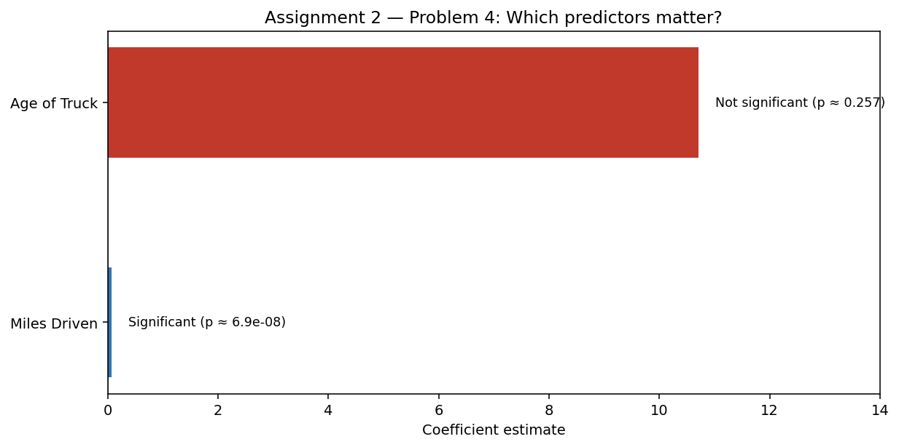
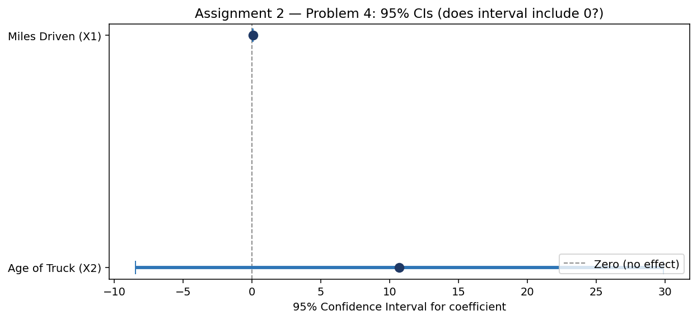

# Regression Inference

**Chapter 10** — Statistical inference in regression (Albright 8e).

## How to follow this assignment

1. Download the Ch. 10 dataset from your **Albright 8e companion site** (maintenance / truck example used here).
2. Run **Data Analysis → Regression** with:
   - Y = Maintenance expense  
   - X1 = Miles Driven  
   - X2 = Age of Truck
3. Record R², Adjusted R², F-test, coefficients, p-values, and **95% confidence intervals**.
4. Decide which predictors are significant at **α = 0.05**.
5. Write the regression equation and interpret each slope.

> Starter `.xlsx` files for Assignment 2 were not saved in this coursework folder. Use your textbook data files.

## Example problem (Problem 4 style)

Maintenance expense modeled with **Miles Driven** and **Age of Truck** (n = 23).

### Model summary

| Metric | Value |
|--------|--------|
| R² | 0.9512 |
| Adjusted R² | 0.9463 |
| F-statistic | 195.02 (p ≈ 7.6×10⁻¹⁴) |
| Equation | ŷ = 11.42 + 0.071·(Miles Driven) + 10.71·(Age of Truck) |

### Coefficients & significance

| Predictor | Coefficient | SE | t | p-value | Keep at α = 0.05? |
|-----------|-------------|-----|---|---------|-------------------|
| Intercept | 11.4184 | 29.191 | 0.391 | 0.700 | — |
| Miles Driven | 0.071214 | 0.008607 | 8.274 | ≈ 6.9×10⁻⁸ | **Yes** |
| Age of Truck | 10.7086 | 9.186 | 1.166 | 0.257 | **No** |

### 95% confidence intervals

| Predictor | Lower 95% | Upper 95% | Includes 0? |
|-----------|-----------|-----------|-------------|
| Miles Driven | 0.0533 | 0.0892 | No → significant |
| Age of Truck | −8.45 | 29.87 | Yes → not significant |

## Visualizations

### Which predictors matter?

### Do the 95% CIs include zero?

## Skills

Regression inference, p-values, confidence intervals, model selection
