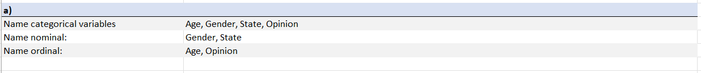
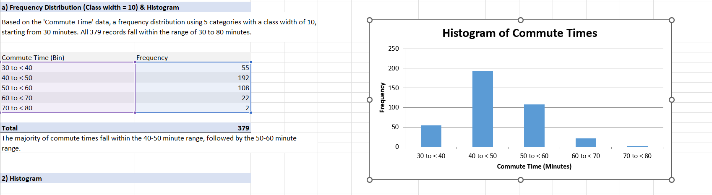
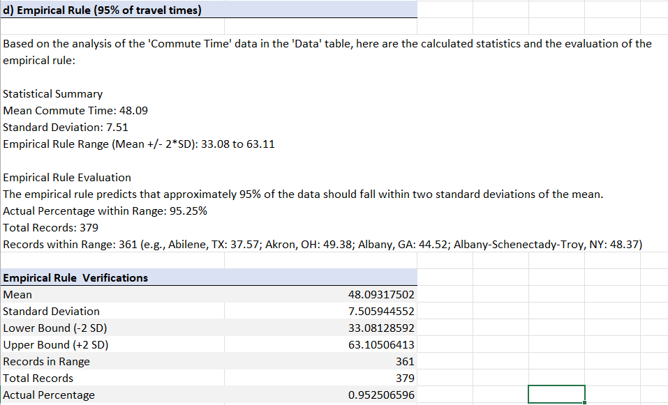
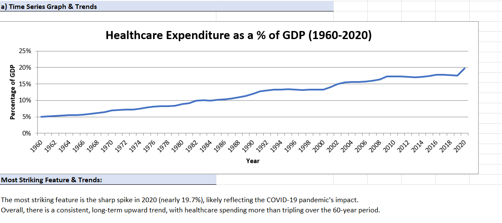
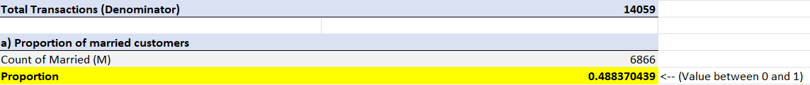
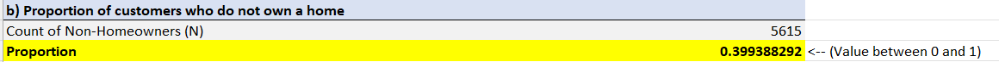
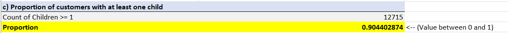
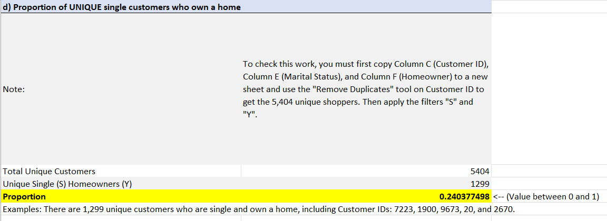

# Descriptive Statistics

**Chapters 1–2** — Describing distributions and categorical data (Albright 8e).

## How to follow this assignment

| Problem | Dataset | What to do |
|---------|---------|------------|
| 3 | `data/P02_03.xlsx` | Name categorical / nominal / ordinal variables; build column charts; recode Gender, Children, Salary, Opinion |
| 6 | `data/P02_06.xlsx` | Frequency table (5 classes, width 10); histogram with labels; choose mean vs median from shape |
| 20 | `data/P02_20.xlsx` | Time-series chart; year-over-year change |
| 36 | `data/Supermarket_Transactions.xlsx` | Summarize a large transaction file (counts, categories, charts) |

Textbook pages: #3 p.50 · #6 p.63 · #20 p.70 · #36 p.78

## Script (optional automation)

```bash
python solve_prob6.py
```

Reads `data/` and writes a formatted answers workbook with **pandas** + **xlsxwriter**.

## Sample work

- `sample-work/Problem_3_Answers.xlsx` — example formatted submission

## Visualizations

### Problem 3 — Categorical variables & column charts




### Problem 6 — Frequency distribution & histogram






### Problem 20 — Time series




### Problem 36 — Supermarket transactions









## Skills

Frequency tables, histograms, empirical rule, categorical recoding, Python Excel formatting
