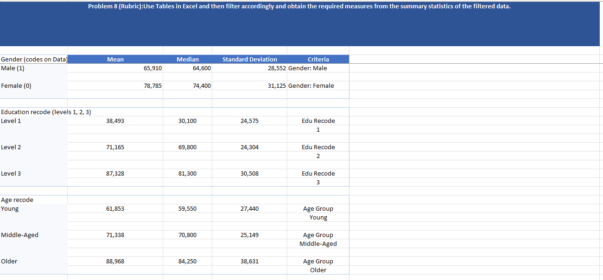
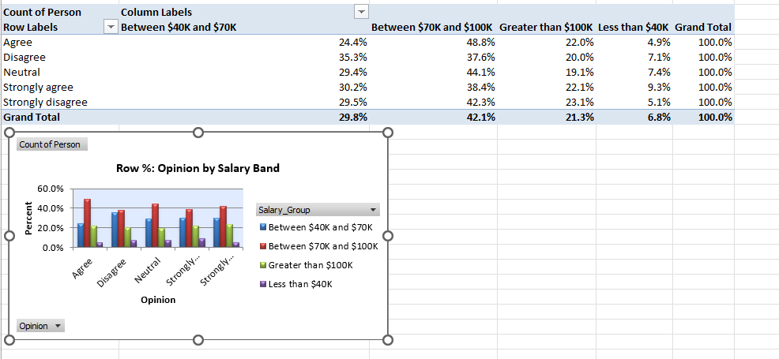

# Variable Relationships

**Chapter 3** — Relationships among variables (Albright 8e).

## How to follow this assignment

| Problem | Dataset | What to do |
|---------|---------|------------|
| 2 | `data/P03_02.xlsx` | COUNTIFS crosstabs of Opinion × Gender / Age / Salary band; column charts with % summing to 100%; short interpretation |
| 8 | `data/P03_08.xlsx` | Excel Table + filters; mean / median / stdev of salary by Gender, Education, Age group |
| 21 | `data/P03_21.xlsx` | Correlation matrix; find strongest predictor of salary; 3 scatterplots; trendline + interpret slope |
| 34 | `data/P03_02.xlsx` | PivotTables with **row %** and **column %** (each sums to 100%) + charts + interpretation |

Textbook pages: #2 p.90 · #8 p.96 · #21 p.104 · #34 p.125

## Scripts

```bash
python solve_assignment4.py   # builds outputs/ (needs Windows Excel)
python _verify_assignment.py
```

## Sample submissions (`outputs/`)

Completed workbooks for Problems 2 & 34, 8, and 21.

## Visualizations

### Problem 2 — COUNTIFS crosstabs & charts


### Problem 8 — Table filters & summary stats



### Problem 21 — Correlation & scatterplots


### Problem 34 — PivotTables (row % and column %)





## Skills

COUNTIFS, pivot tables, correlation, Excel Tables, Python/openpyxl automation
