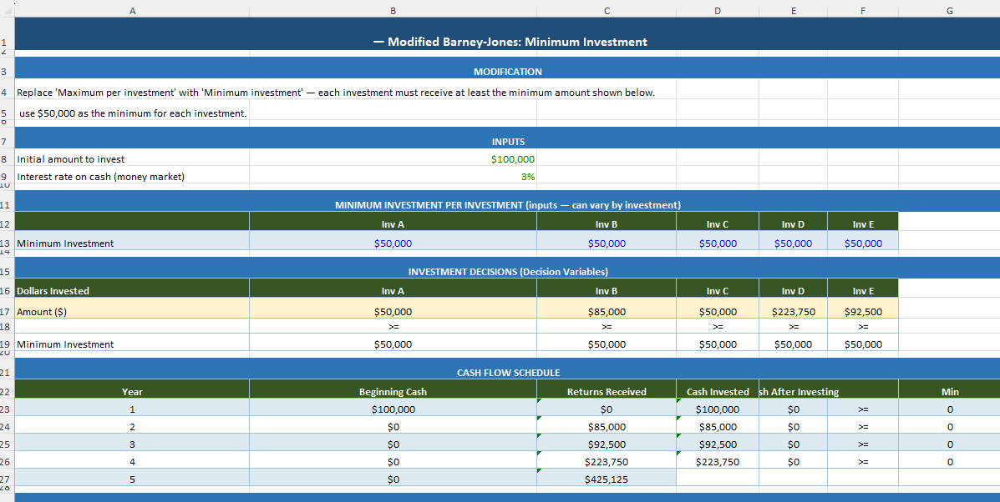

# Optimization with Solver

**Chapter 13** — Advanced Solver applications (Albright 8e).

## How to follow this assignment

| Problem | Topic | Dataset in `data/` | What to do |
|---------|--------|--------------------|------------|
| 1 | Worker scheduling | `Worker Scheduling.xlsx` | Minimize cost / meet staffing by day-shift |
| 13 | Transportation | `Transportation.xlsx`, `worker Transportation.xlsx` | Ship from sources to destinations at min cost |
| 37 | Investing | `Investing.xlsx` | Allocate portfolio under risk / return constraints |

### Solver checklist

1. Open the template in `data/`.
2. Confirm decision variables, objective, and constraints.
3. Run Solver and save the optimal plan.
4. Compare your result to the sample files in `workbooks/`.

## Sample submissions (`workbooks/`)

Includes `Worker Scheduling Solution.xlsx`, `Transportation Solution.xlsx`, and `09-Investing Solutions.xlsx`.

## Visualizations

### Problem 1 — Worker scheduling

### Problem 13 — Transportation

### Problem 37 — Investing

## Skills

Excel Solver, scheduling, transportation, investment optimization
