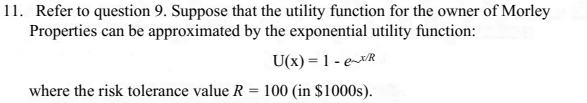

# Decision Analysis

**Chapter 7** — Decision analysis under uncertainty (Albright 8e).

## How to follow this assignment

1. Open `data/Assignment 7 Problem 10.xlsx`.
2. Identify **decision alternatives**, **states of nature**, and **payoffs**.
3. Compute **expected value** (and related criteria your instructor requires).
4. Document the key equation / decision rule.
5. Optionally build a decision tree for the same payoffs.

## Dataset (`data/`)

| File | Use |
|------|-----|
| `Assignment 7 Problem 10.xlsx` | Completed Problem 10 decision model (payoffs + Excel setup) |

A copy also sits at the folder root for quick access.

## Visualizations

### Key decision equation

**What to notice:** The equation links payoffs and probabilities (or expected-value weights) so you can choose the best alternative under uncertainty.

## Skills

Decision trees, expected value, payoff tables, sensitivity to probabilities
