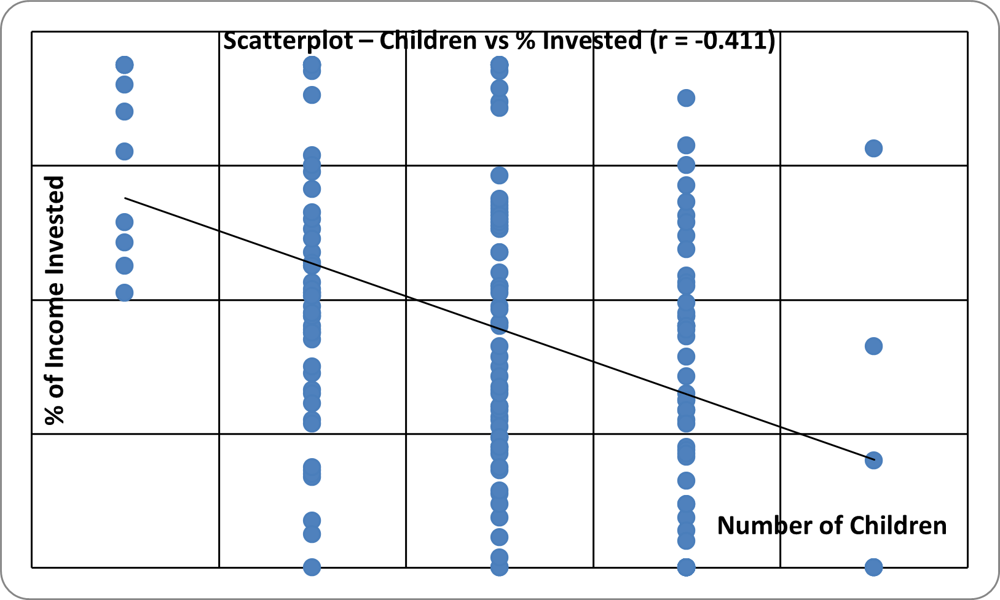
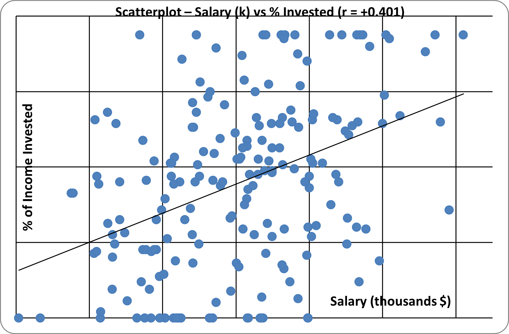
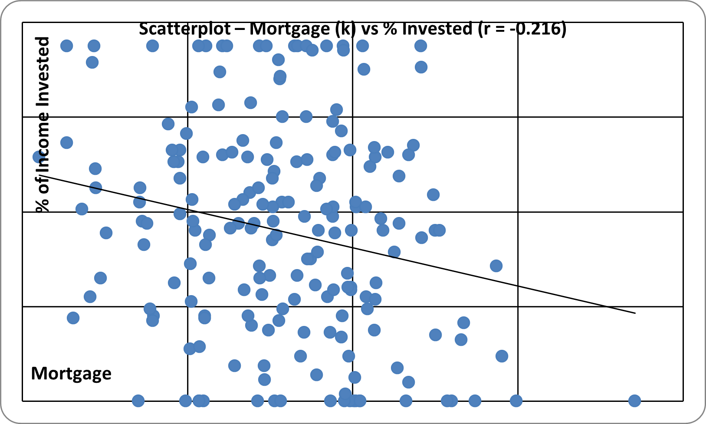
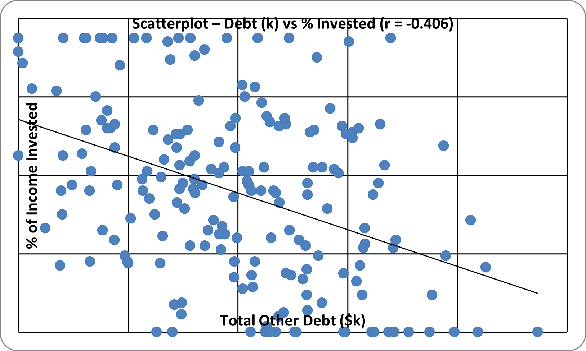

# Case Study — Retirement Plan Investment

**Dataset:** C09_04 (194 observations) — Albright Ch. 9  
**Team 27:** Shakila Azad, Aashka Bhagat, Javari Simmons

## How to follow this case study

1. Open `data/C09_04.xlsx` (194 couples).
2. Dependent variable: **% of income invested** in tax-deferred retirement plans.
3. Predictors: Children, Salary (k), Mortgage (k), Debt (k).  
   Do **not** use Couple as a predictor (it is only an ID).
4. Run multiple regression → drop insignificant predictors (e.g. Children).
5. Interpret coefficients, R², and scatterplots.
6. Compare your write-up to the interactive report: [`index.html`](index.html).

## Dataset (`data/`)

| File | Description |
|------|-------------|
| `C09_04.xlsx` | Children, salary, mortgage, debt, % invested |

## Research question

What financial and demographic factors predict the **percentage of income invested** in tax-deferred retirement plans?

## Visualizations

### Scatterplots — predictors vs. % invested

## Full report

Open **[`index.html`](index.html)** for regression tables, model fit, correlation, and conclusions.

## Skills

Multiple regression, model selection, interpretation, visualization, teamwork
